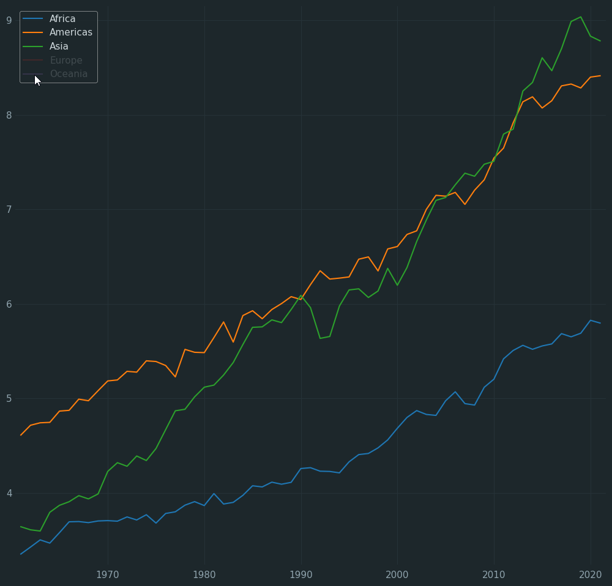
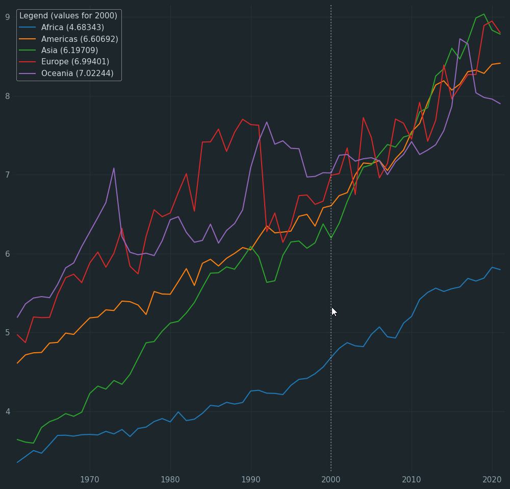
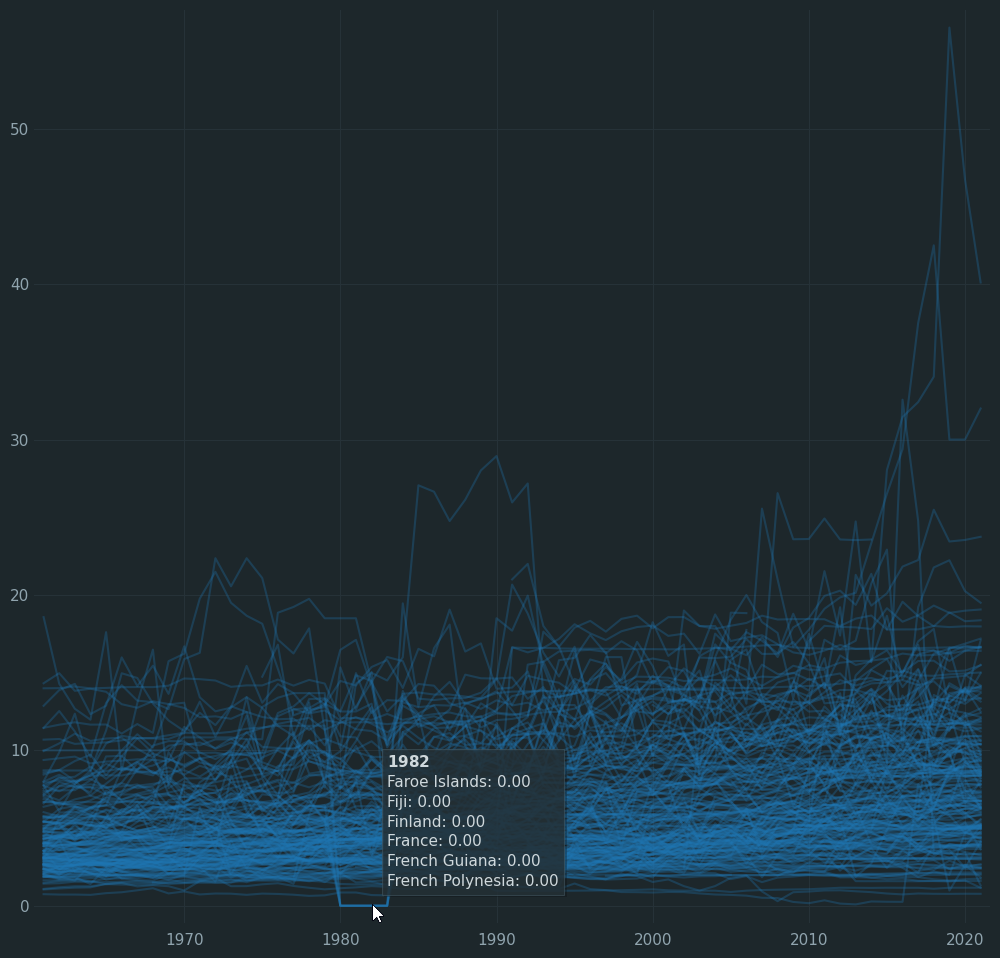
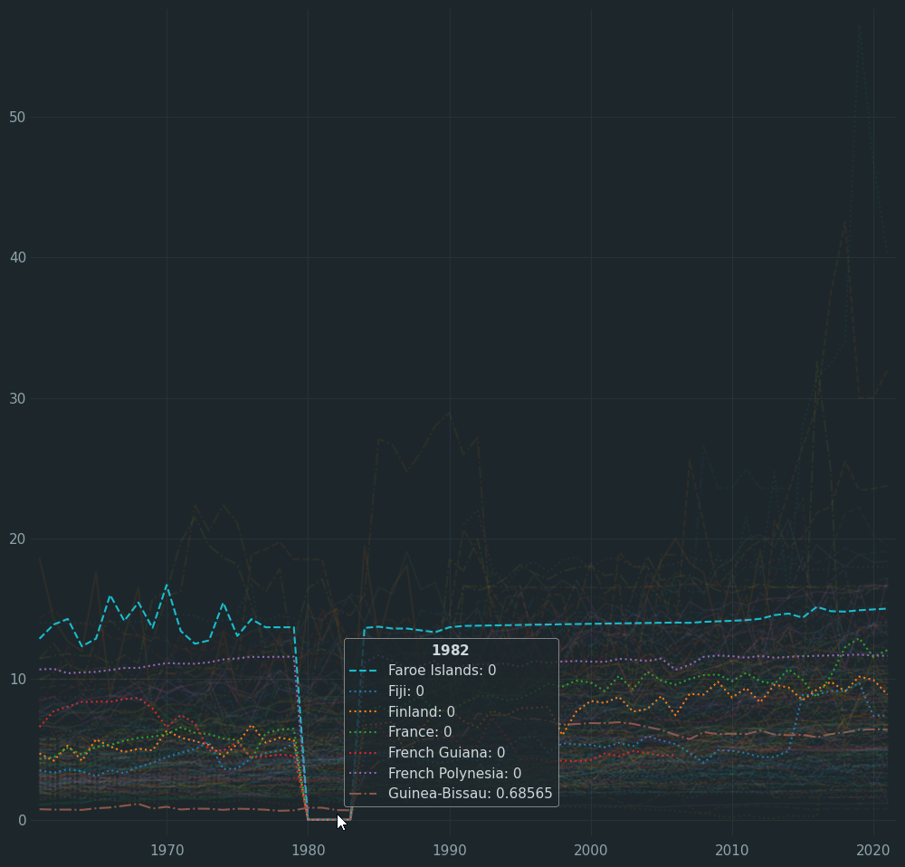
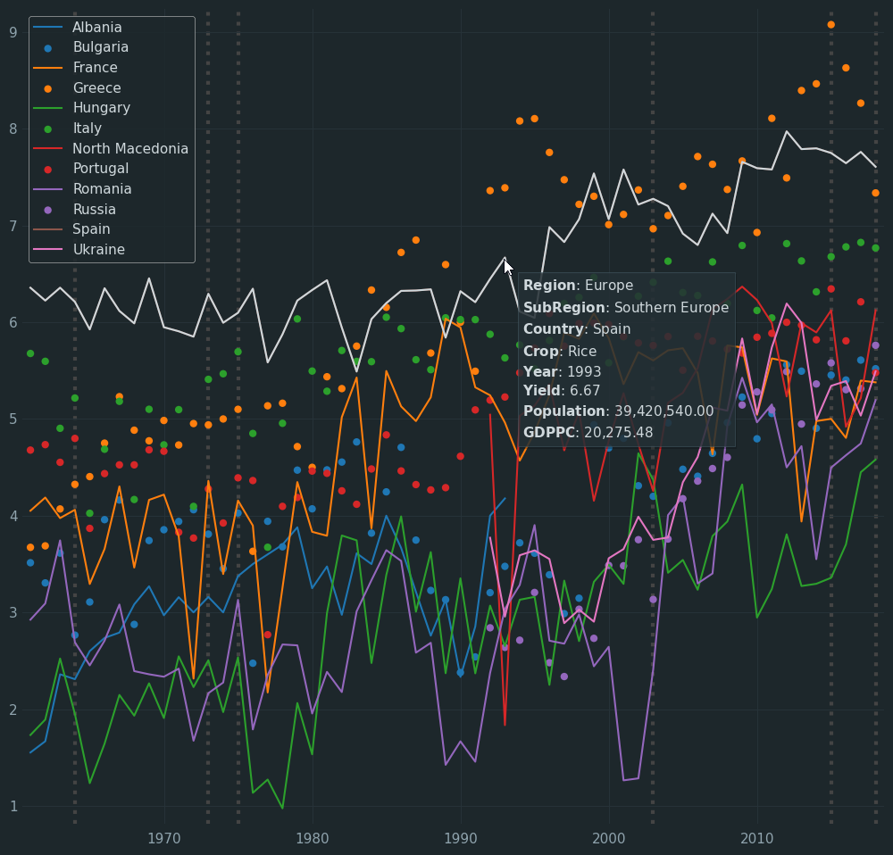
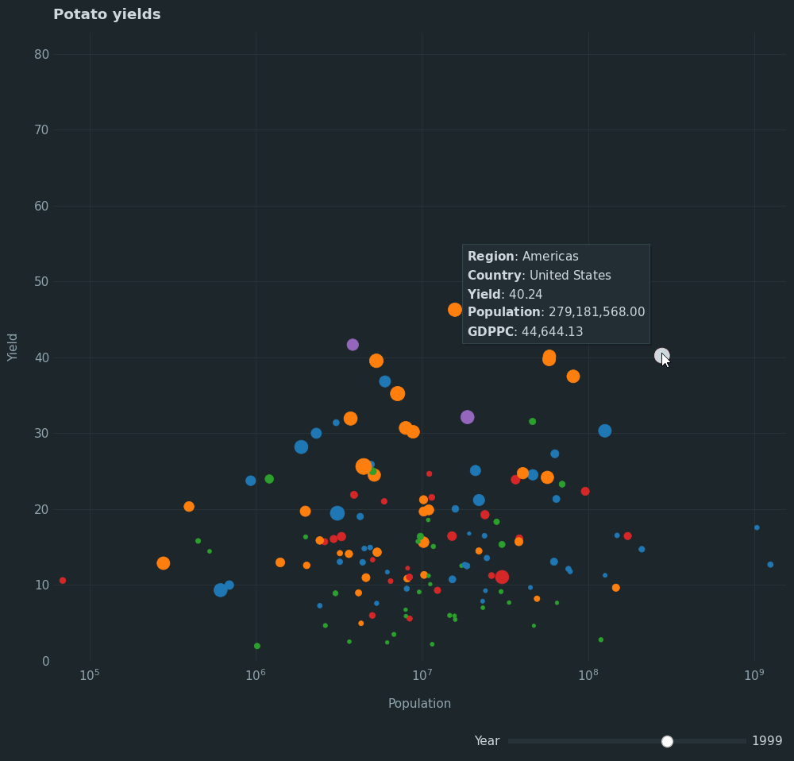
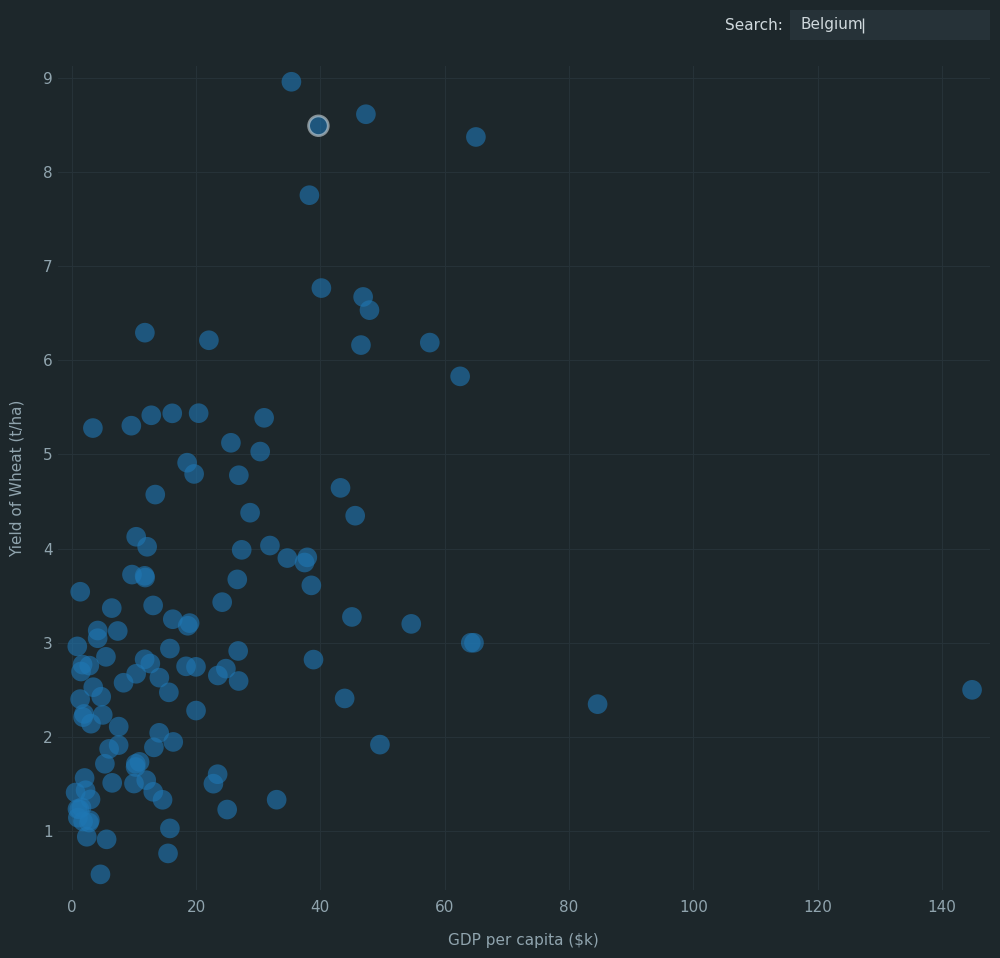
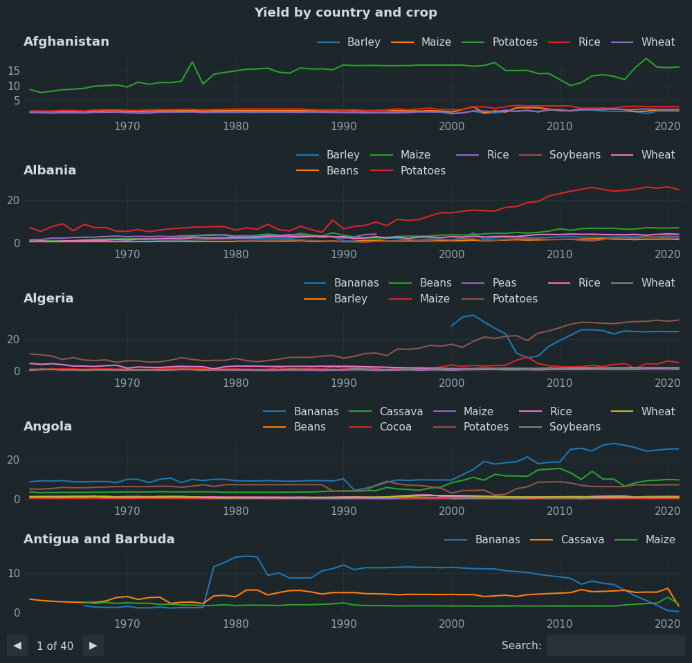
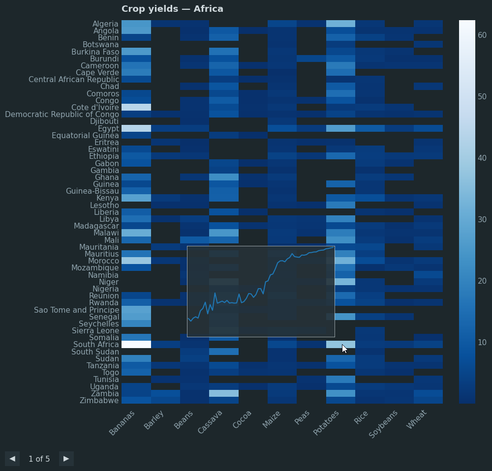

# Interactive Matplotlib for Exploratory Data Analysis

🚧 This is the repository for an upcoming course, currently a work in progress.

To run the code in this repo, you'll need four packages:

```bash
pip install matplotlib numpy pandas mplcursors
```

## Index

The below maps the Udemy course sections and lectures to the files used in those lectures.

| Section          | Lecture                                 | File                                                                                                      |
|------------------|-----------------------------------------|-----------------------------------------------------------------------------------------------------------|
| 1. Overview      | 101 Overview and housekeeping           |                                                                                                           |
| 1. Overview      | 102 The course codebase                 |                                                                                                           |
| 1. Overview      | 103 The Matplotlib docs                 |                                                                                                           |
| 2. Introduction  | 201 Your first chart                    | [201_your_first_chart.py](theory/201_your_first_chart.py)                                                 |
| 2. Introduction  | 202 Chart types                         | [202_chart_types.py](theory/202_chart_types.py)                                                           |
| 2. Introduction  | 203 Multiple charts                     | [203a_multi_series.py](theory/203a_multi_series.py) & [203b_multi_axes.py](theory/203b_multi_axes.py)     |
| 3. Interactivity | 301 Backends and interactive mode       | [301_interactive_mode.py](theory/301_interactive_mode.py)                                                 |
| 3. Interactivity | 302 The interactive figure window       | [302_reusing_the_window.py](theory/302_reusing_the_window.py)                                             |
| 4. Config        | 401 Sharing config                      | [401_config_setup.py](theory/401_config_setup.py)                                                         |
| 4. Config        | 402 Configuring styles                  | [402_styles.py](theory/402_styles.py)                                                                     |
| 4. Config        | 403 Hooks                               | [403_hooks.py](theory/403_hooks.py)                                                                       |
| 4. Config        | 404 Tick location                       | [404_tick_locating.py](theory/404_tick_locating.py)                                                       |
| 4. Config        | 405 Tick formatting                     | [405_tick_formatting.py](theory/405_tick_formatting.py)                                                   |
| 5. Events        | 501 Mouse events                        | [501_mouse_events.py](theory/501_mouse_events.py)                                                         |
| 5. Events        | 502 Clearing events                     | [mpl_utils/\_\_init\_\_.py](./mpl_utils/__init__.py)                                                      |
| 5. Events        | 503 Keyboard events                     | [text_zoom.py](./mpl_utils/text_zoom.py)                                                                  |
| 5. Events        | 504 Figure events                       | [mpl_utils/\_\_init\_\_.py](./mpl_utils/__init__.py)                                                      |
| 5. Events        | 505 Picking                             | [interactive_legend.py](./mpl_utils/interactive_legend.py)                                                |
| 5. Events        | 506 Interactive legend: visual feedback | [interactive_legend.py](./mpl_utils/interactive_legend.py)                                                |
| 5. Events        | 507 Interactive legend: focus on hover  | [interactive_legend.py](./mpl_utils/interactive_legend.py)                                                |
| 5. Events        | 508 Accessing chart data                | [dynamic_legend.py](./mpl_utils/dynamic_legend.py)                                                        |
| 5. Events        | 509 Dynamic legend: adding polish       | [dynamic_legend.py](./mpl_utils/dynamic_legend.py) & [event_helpers.py](./mpl_utils/event_helpers.py)     |
| 5. Events        | 510 Date data                           | [dynamic_legend.py](./mpl_utils/dynamic_legend.py) & [mpl_utils/\_\_init\_\_.py](./mpl_utils/__init__.py) |
| 6. Tooltips      | 601 Adding text to a chart              | [601_text_options.py](theory/601_text_options.py)                                                         |
| 6. Tooltips      | 602 Custom tooltip                      | [custom_tooltip.py](./mpl_utils/custom_tooltip.py)                                                        |
| 6. Tooltips      | 603 Blitting                            | [custom_tooltip.py](./mpl_utils/custom_tooltip.py)                                                        |
| 6. Tooltips      | 604 Legend tooltip                      | [legend_tooltip.py](./mpl_utils/legend_tooltip.py)                                                        |
| 6. Tooltips      | 605 Mplcursors tooltip                  | [mplcursors_tooltip.py](./mpl_utils/mplcursors_tooltip.py)                                                |
| 6. Tooltips      | 606 Tooltips on a heatmap               | [heatmap.py](./mpl_utils/charts/heatmap.py)                                                               |
| 7. Layouts       | 701 Overview                            | [701a_subplots.py](theory/701a_subplots.py) & other 701x files                                            |
| 7. Layouts       | 702 Combining fixed and relative        | [layouts.py](./mpl_utils/layouts.py)                                                                      |
| 7. Layouts       | 703 Fixed placement axes                | [layouts.py](./mpl_utils/layouts.py)                                                                      |
| 8. Widgets       | 801 Widget introduction                 | [801_widgets_introduction.py](theory/801_widgets_introduction.py)                                         |
| 8. Widgets       | 802 Slider widget                       | [802_slider_widget.py](theory/802_slider_widget.py)                                                       |
| 8. Widgets       | 803 TextBox widget                      | [searchable_scatter.py](./mpl_utils/charts/searchable_scatter.py)                                         |
| 8. Widgets       | 804 Paginator                           | [paginator.py](./mpl_utils/charts/paginator.py)                                                           |
| 9. Finale        | 901 Chart context manager               | [chart_manager.py](./mpl_utils/chart_manager.py)                                                          |
| 9. Finale        | 902 Faster charts                       | [chart_manager.py](./mpl_utils/chart_manager.py)                                                          |
| 9. Finale        | 903 Scroll to zoom                      | [chart_manager.py](./mpl_utils/chart_manager.py)                                                          |
| 9. Finale        | 904 Axes tooltip                        | [axes_tooltip.py](./mpl_utils/charts/axes_tooltip.py)                                                     |

# Course gallery

These are some of the charts that we create throughout the course.

An interactive legend (click to hide/show lines)



A dynamic legend (show data values in legend)



A custom tooltip (show items under the cursor)



Another custom tooltip, using the legend and highlighting lines



Using `mplcursors` to create a tooltip with extended data for a single point



Using a `Slider` widget to visualize with motion



Using a `TextBox` widget to search for a point in a scatter plot



Using a paginated chart to display many axes over several 'pages'. 

This also lets you filter the data with a text box.



Show an axes as a tooltip on another axes.


